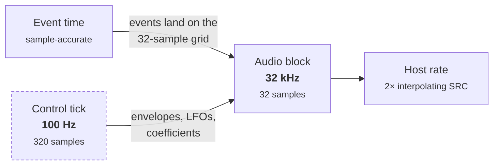
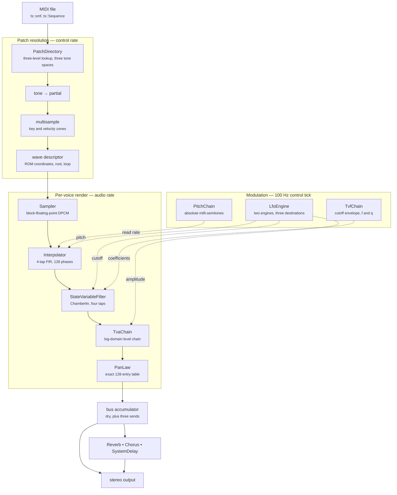
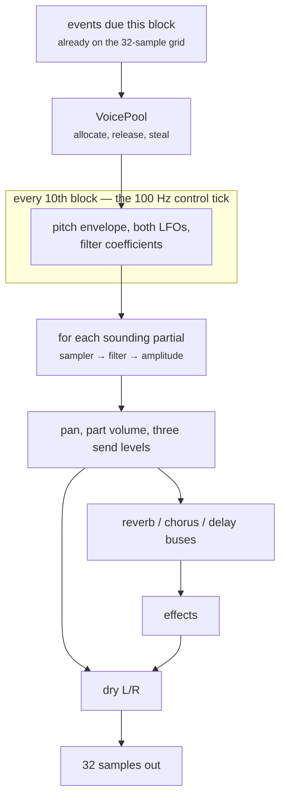

# Architecture {#architecture}

## Four clock domains

Most of the design falls out of the fact that the original engine runs on four different clocks.

| Domain | Rate | What happens there |
|---|---|---|
| Event time | sample-accurate | MIDI ingest, parsing, SysEx |
| Control tick | **100 Hz** (320 samples) | envelopes, LFOs, coefficient recompute |
| Audio block | 32 kHz internal, **32-sample blocks** | samplers, filters, bus mix, effects |
| Host rate | whatever the host asks for | a 2× interpolating rate conversion at the very end |

The engine always renders at 32 kHz, the hardware's own rate. Everything upstream of the final
conversion is in that domain, which is why ts::NoteRenderer::sample_rate is a constant rather than
a setting.

Note that MIDI events land on the **32-sample** block grid, not the 100 Hz control tick. Reading a
controller at tick resolution is ten times too coarse and audibly smears a continuous pitch bend —
this was a real defect during development.

## Objects at the seams, flat arrays underneath

The library is object-oriented where dispatch is cheap and data-oriented where it is not.

Control-rate work — patch resolution, envelopes, effect selection — is ordinary C++ with real types
and, in the effects, real virtual dispatch through ts::Effect. At 100 Hz, or once per 32-sample
block, a virtual call costs nothing measurable.

Per-sample work is flat. ts::VoicePool holds its 64 voices as parallel arrays rather than as
objects, which is the shape the original uses too: it renders voices in SIMD-friendly groups of
four. ts::Voice is a handle — an index plus control-rate operations — not a container for render
state.

## The signal path

Solid arrows are the audio path; dotted arrows are control-rate parameter flow. The classes are
ts::PatchDirectory, ts::Sampler, ts::Interpolator, ts::StateVariableFilter, ts::TvaChain,
ts::PanLaw, ts::PitchChain, ts::LfoEngine, ts::TvfChain, and the three ts::Effect implementations.

Partials **sum**. Each is an independent voice dispatched into one accumulation buffer; there is no
divide-by-count anywhere, and averaging would silently halve every two-partial patch.

## Two ways to drive it

The same signal path is driven by two renderers, which differ in *when* they know things rather
than in what they compute.

| | ts::SequenceRenderer | ts::ToneGenerator |
|---|---|---|
| unit of work | one whole note | one 32-sample block |
| note length | known before rendering | discovered when note-off arrives |
| polyphony | unbounded | 64 voices, stolen when full |
| controllers | latched at note-on, curves per sample | live, re-read every block |
| effect type | one per song | changes when the file says so |
| parts | 16 channels | 32 parts over two ports |

Neither is a reimplementation of the other. The envelopes, the sampler, the filter and the tables
are one set of objects that both drive; the offline path fills arrays from them and the block loop
steps them. That is why a single note with no controller movement comes out **identical to float
epsilon** through either — asserted in the test suite, not asserted by hand.

Both are comfortably faster than realtime on one core: the offline path renders a 123-second,
4,366-note file in about seven seconds. `tabula-sonora bench` reports the margin on your machine,
stage by stage.

### The block loop

A block never straddles a control tick: voices start on the block grid and the tick is ten blocks
long, so the coefficient refresh always lands on a boundary.

Two details are load-bearing. A stolen voice is **faded, not cut** — 4 ms at level and 6 ms down,
which is what the engine does when a drum choke group fires, and a hard stop instead is an audible
click. And the filter's coefficients are taken from the cutoff envelope's **mean over the block
they will serve**, not from its value at the tick: the envelope can cross several segments inside
one 10 ms tick, and a single sample point costs about 1.7% of peak on a piano attack.

A host that wants audio out of ts::ToneGenerator on another thread takes it through
ts::FrameRing, the lock-free single-producer, single-consumer ring the players use. The engine
itself is single-threaded by contract: events and rendering must come from the same thread.

## Things that are easy to get wrong

These are all asserted in the test suite, because each one is silent when wrong:

- **Looping is decided by whether a sustain region exists**, not by the descriptor's loop flag —
  that flag reads zero for piano, so trusting it makes held notes run out as one-shots.
- **The loop period is inclusive of the data end.** Off by one is inaudible on a long loop and
  detunes a single-cycle one by 27 cents.
- **Drums take a different pitch route.** The note selects the kit entry, not the pitch: the tone
  sounds at key 60 and the kit's coarse plane scales it at *half* strength.
- **Levels are amplitude-squared** throughout, and `g_amp_curve_hi[0]` is 4 rather than 0, so a
  level that decays past the floor must be forced to true silence rather than clamped into the
  table.
- **The velocity level-scale is split** — one byte for the first two envelope segments, another for
  the rest. Sharing one makes later segments run about 1.45× too fast.
- **Every layer borrows the one below it.** ts::NoteRenderer keeps a reference to the image and
  ts::SequenceRenderer a raw pointer to the renderer, so a host that holds the chain by value and is
  then moved leaves both addressing moved-from shells. `std::unique_ptr` members keep the addresses
  the layers above captured — see \ref getting-started.

## Fixed-point

The original's control path is exclusively 16-bit fixed point, and several expressions depend on
wrapping or on truncation direction rather than merely tolerating them. The port uses `int` as the
universal intermediate, makes every width truncation explicit, and widens to 64 bits at the three
sites where a product exceeds 32 bits — the amplitude curve, the part volume, and the filter's
exponential decode.

A fourth such site was found by ear rather than by inspection: the chorus tap offset reaches 4.3e10
and wrapped silently, putting one channel at the wrong delay.

C++20 is the first standard that defines enough of this to port safely: signed integers are
mandated two's complement, `>>` on a signed value is an arithmetic shift, `<<` is congruent modulo
2^N, and narrowing conversions to signed types are modular. What it still leaves undefined is
signed overflow from `+`, `-` and `*`, so every expression that is *meant* to overflow goes through
the helpers in `src/dsp/fixed.hpp` — and an ordinary `a * b` in this codebase should be read as a
claim that the product fits.

Two build flags are correctness requirements rather than tuning knobs, both set in `CMakeLists.txt`
and exported to consumers through `ts::numeric_semantics`: `-ffp-contract=off`, because clang
defaults to `fast` and will fuse `a*b+c` into an FMA that breaks the float/double narrowing the DSP
depends on, and `-fwrapv` as belt-and-braces alongside those helpers. **Never add `-ffast-math`**:
the block loop relies on exact signed-zero behaviour.
