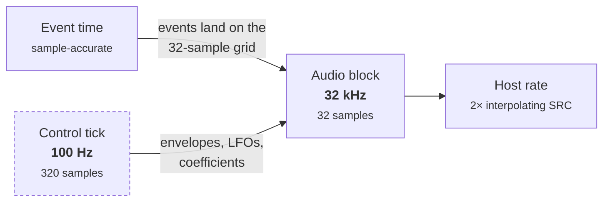
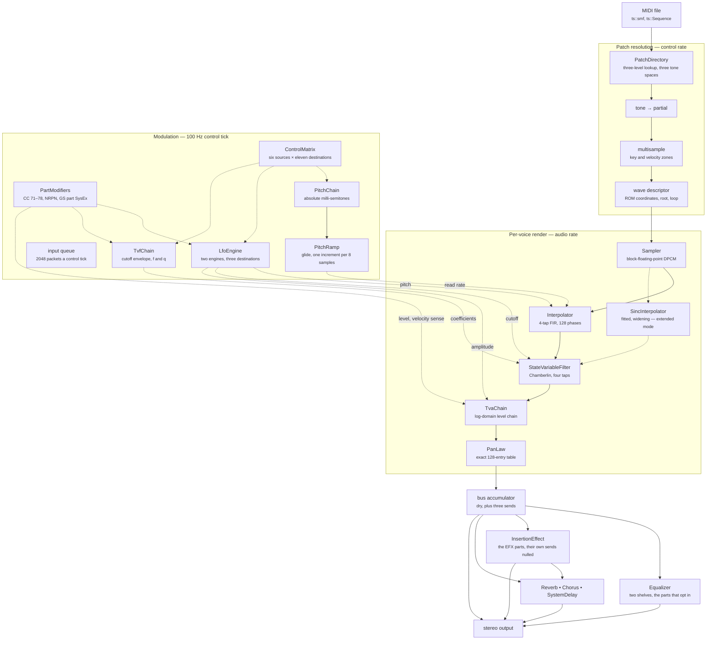
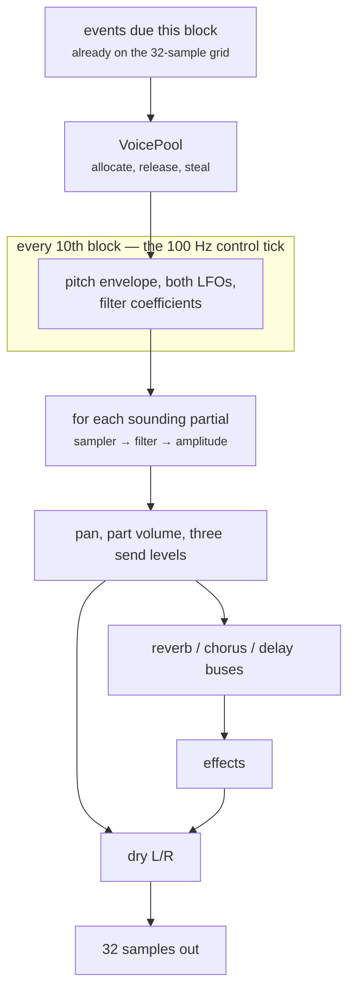

# Architecture {#architecture}

## Four clock domains

Most of the design falls out of the fact that the original engine runs on four different clocks.

| Domain | Rate | What happens there |
|---|---|---|
| Event time | sample-accurate | MIDI ingest, parsing, SysEx |
| Control tick | **100 Hz** (320 samples) | envelopes, LFOs, coefficient recompute |
| Audio block | 32 kHz internal, **32-sample blocks** | samplers, filters, bus mix, effects |
| Host rate | whatever the host asks for | a 2× interpolating rate conversion at the very end |

The engine always renders at 32 kHz, the hardware's own rate. Everything upstream of the final
conversion is in that domain, which is why ts::NoteRenderer::sample_rate is a constant rather than
a setting.

Note that MIDI events land on the **32-sample** block grid, not the 100 Hz control tick. Reading a
controller at tick resolution is ten times too coarse and audibly smears a continuous pitch bend —
this was a real defect during development.

## Objects at the seams, flat arrays underneath

The library is object-oriented where dispatch is cheap and data-oriented where it is not.

Control-rate work — patch resolution, envelopes, effect selection — is ordinary C++ with real types
and, in the effects, real virtual dispatch through ts::Effect. At 100 Hz, or once per 32-sample
block, a virtual call costs nothing measurable.

Per-sample work is flat. ts::VoicePool holds its voices as parallel arrays rather than as objects,
which is the shape the original uses too: it renders voices in SIMD-friendly groups of four.
ts::Voice is a handle — an index plus control-rate operations — not a container for render state.
The pool is the hardware's 64 slots by default and can be sized past that, or told to grow on
demand; the layout does not change with it.

## The signal path

Solid arrows are the audio path; dotted arrows are control-rate parameter flow. The classes are
ts::PatchDirectory, ts::Sampler, ts::Interpolator, ts::StateVariableFilter, ts::TvaChain,
ts::PanLaw, ts::ControlMatrix, ts::PartModifiers, ts::PitchChain, ts::PitchRamp, ts::LfoEngine,
ts::TvfChain, ts::Equalizer, ts::InsertionEffect, and the three ts::Effect implementations.

The insertion block sits *ahead* of the send network rather than beside it. A part routed to it by
`40 4x 22` has both of its own sends forced off and its dry signal detoured into the block, and it
is the block's output that rejoins the dry mix and feeds the three send buses, at the common levels
`40 03 17`–`19`. That is the mechanism behind the manual's note that system-effect levels become
common to all EFX parts. Only a first tranche of the 65 types has its algorithm transcribed — a
type outside it passes the signal through unchanged, with routing and sends still honoured, and
says so through ts::InsertionEffect::implemented. See \ref signal-flow.

Partials **sum**. Each is an independent voice dispatched into one accumulation buffer; there is no
divide-by-count anywhere, and averaging would silently halve every two-partial patch.

### What moves while a note sounds

Besides its own envelopes, three things reach a sounding voice, by three different routes because
the module gives them three different routes.

**The control matrix.** ts::ControlMatrix is the GS controller assignment block, `40 2x`: six
sources — the mod wheel, bend, channel and polyphonic aftertouch, and the part's CC1 and CC2 — each
with eleven destinations, from pitch and cutoff through both LFOs' rates and depths. The depths are
0x40-centred, so a source assigned nothing anywhere leaves the voice alone, and one route is not
zero at power-on: the mod wheel's LFO1 pitch depth, which is why a GM file's mod wheel produces
vibrato without being told to.

Bend goes *through* the matrix rather than around it, and its own law — a per-destination 16-bit
scale rather than a shift. Its pitch depth is the one cell the matrix does not store, because
`40 2x 10` and RPN 00/00 are not two parameters that agree but one byte written by both handlers;
ts::Part::bend_range owns it.

Polyphonic aftertouch is the one source that is not a property of the part: ts::Part::poly_pressure
keeps a byte per key, so two notes held on one part can be bent by different amounts, which is the
whole of what "polyphonic" buys. It does **not** reset when a key is struck again — press a key
hard, release it, strike it once more and say nothing about pressure, and the module sounds the new
note still bent. That was measured against the DLL, and it is the opposite of the obvious guess.

**All eleven destinations are consumed**, each in its own unit and by its own consumer. Pitch and
the two LFOs' pitch depths are milli-semitones; cutoff and the LFOs' filter depths are the filter's
own units, at 2.56 a cent; amplitude and the LFOs' amplitude depths are fractions of 0x7f00; and
the two rates are per-tick phase increments, where 6553 is 10 Hz. The eleven scales are not eleven
arbitrary constants — each one's full-scale result is exactly the figure the GS documentation names
for that parameter (±24 semitones, ±9600 cents, ±100 %, ±10 Hz, and 600, 2400 and 100 for the LFO
depths), and eleven constants reproducing seven published numbers is the check that the table has
been read off the engine correctly rather than guessed.

Where each one lands is decided by what it modulates rather than by where it came from. Cutoff
joins the sum the filter clamps once, alongside both LFOs' filter modulation. Amplitude joins the
tremolo sum before *its* clamp, so a part already driven to the rail by tremolo cannot be pushed
past it by a controller. The six LFO depths are summed onto the patch's own depth after the
fade-in, because the fade belongs to the patch and a controller arriving mid-fade is not faded in
with it. And the two rates are added to the LFO's increment, which is not merely a speed control:
an increment driven to nothing stops that LFO outright — the module skips the whole update, so the
depths stop being applied too.

**An LFO's delay does not hold back a controller.** It holds back the *fade-in*, and the fade
scales the patch's own depth — so while it sits at zero the patch contributes nothing whichever way
one models it, but a matrix depth is summed past the fade and reaches the voice from the note's
first tick. Suppressing the whole update during the delay looks equivalent and is not, which is
exactly what it did here until the module was asked: on a patch whose LFO1 delay runs 710 ms,
driving that LFO's amplitude depth from the mod wheel, the module modulates immediately and this
engine was flat for 710 ms and then agreed exactly.

**The LFOs the matrix drives are not all functions of their phase.** Most of the shapes are — ask
where in the cycle the LFO is and the value follows. Three are not: selectors 1, 2 and 3 redraw
from the engine's shared generator when the phase *wraps*, and either hold that draw (sample and
hold) or walk toward it by a fixed step per tick. Selectors 2 and 3 are the same shape; the module
has two cases for them and they are identical. This is why ts::LfoRunner carries waveform state
rather than recomputing from the phase: a slewed shape that has arrived at its target leaves its
output untouched, so the previous tick's value *is* this tick's answer, and there is no phase to
recover it from. The generator is one shared sequence — ts::EngineNoise — and it has five
consumers, each drawing only when its own byte is non-zero so an unaffected patch leaves the
sequence where it found it: the base-pitch jitter at partial `+0x12`, the pitch envelope's start
jitter at `+0x1a`, the random partial select in the tone common at `+0x22`, the random pan, and
these three LFO shapes. Which voice draws when is therefore part of what the sequence is, and it is
why \ref signal-flow records the order voices are set up in as a property of the engine rather than
an implementation detail. ts::EngineNoise::discard exists for the same reason: the module makes
draws this port has no use for, and skipping them silently would put every later consumer on the
wrong value.

**All six sources reach them**, including the two assignable controllers — which are not Control
Change #1 and #2, a collision in the GS naming worth stating once. CC1 and CC2 are *sources* that
listen to whatever Control Change number `40 1x 1F` and `20` name; they start on General Purpose 1
and 2 because nothing else reads those, and the number is clamped to 0–95. Pointing one at a
controller that already means something does not take that meaning away — the message does both
jobs, so a part whose CC1 is aimed at the mod wheel has a wheel driving its own routes and CC1's.

**The part modify offsets.** ts::PartModifiers is the eight 0x40-centred bytes behind CC#71–78 —
vibrato rate, depth and delay, cutoff, and the envelope's attack, decay and release. Three writers
share each byte: the sound controller, an NRPN and the part SysEx `40 1x 3x` all land on the same
address in the engine. TVF resonance is deliberately absent from the set. Its byte exists and all
three handlers write it; nothing in the engine ever reads it.

**Two SysEx dialects.** GS is not the only one. XG System On switches the engine into a mode with
its own parameter set, its own tone and drum maps, and an inverted bank pair — the variation in the
LSB, and the MSB selecting melodic, SFX voices, SFX kits or drum kits. Any Roland message or GM
reset switches back, so a file mixing the two flips the instrument rather than layering them. The
decode is shared between front ends the way the GS one is (ts::decode_xg_sysex,
ts::decode_xg_multi_part), and what *changes per part* — its map, its lookup bank, whether it is
drums, which kit — the engine reports rather than leaving a caller to infer from the channel number,
because under XG the channel number answers none of it. See the getting-started article.

**The pitch ramp.** ts::PitchRamp is the one that is easy to leave out and audible when you do. The
engine does not step a voice's pitch once per 10 ms tick: it records the pitch entering the block
and the pitch leaving it, and glides between them, writing a fresh sampler increment every eight
samples. Without the glide the sub-sample residue is frozen into the sampler's phase for the rest
of the note, which selects a different interpolator row from there on — drum tone 1946 drops 6.671
semitones inside its first block and comes out about 1.1 dB bright. \ref verification has the
measurement.

### The equalizer

ts::Equalizer is the GS "four-band" EQ, which is two shelves: a low and a high, each with a
frequency and a gain from `40 02`, written to the left and right registers with identical values so
that the spectrum moves and the stereo image does not.

It is not a send. Parts that switch it on with `40 4x 20` mix into an EQ bus, that bus is filtered
once and summed into the dry pair — the same result as filtering each part separately, the filter
being linear and every part sharing one coefficient set. Both gains flat is exactly unity, so the
stage is skipped rather than approximated.

The part switch defaults **off**, which is what the binary does and not what the SC-8820 manual
says. \ref verification sets out the disagreement, since it is the one claim there resting on
absence of evidence rather than on measurement.

## One way to drive it

ts::ToneGenerator is the engine and the renderer both. `tabula-sonora render` and
`tabula-sonora-play` differ in *when* the work happens, not in what does it, and a file exported
from the browser is byte-identical to one rendered at the command line because there is only the
one path for them to be identical to.

An offline renderer that built each note whole and summed them also existed here, and was deleted.
It could not put a mid-song change where the stream put it — an effect type that switches between
two notes has to be resolved *per note* rather than at the moment it arrives — so on the property
that matters most for judging fidelity it was the architecture that could not be right.
\ref verification has the reasoning.

What varies is how much the engine is allowed to spend:

| | default | past the hardware |
|---|---|---|
| polyphony | 64 voices, stolen when full | any limit, or `ToneGeneratorOptions::unlimited_polyphony`, which **grows** the pool instead of stealing |
| parts | 32, over two ports | 64, over four — an extension, not a fidelity feature |

Two settings go the other way, and are off by default because the *engine* is the departure rather
than the option: `ToneGeneratorOptions::event_delay_blocks` stages a message through the module's
rings before a part sees it, and clearing `ToneGeneratorOptions::bypass_output_filter` runs the
module's output stage. Both cost latency this engine otherwise does not have — 128 samples and 1 —
and both are what the module always does, with no switch of its own. Anything compared against it
wants them on; the suite leaves them off because much of it reads part state back synchronously.

The growing pool is what an offline render wants and what an audio thread must not have: growing
allocates, and allocating inside the block loop is the one thing a real-time thread cannot do. Both
settings are departures, so both are opt-in — the principle throughout is to match the module by
default and exceed it only on request.

ts::NoteRenderer::render_note is not a second renderer. It renders one note in isolation, which is
what analysis and the C# note digest want, and neither of those is a song.

The authoritative note gate does *not* use it, and the reason is worth stating: the oracle audio it
compares against came out of the DLL's whole pipeline, so it drives one note through the block loop
instead. A standalone note renderer is a different signal path — no part processing, no output
stage — and comparing against it would measure the gap between two architectures and call it a
defect. That choice paid a second time when the sweep grew drum cases: a kit is reached by sending a
program change to channel 10, and a renderer with no parts has no channel 10 to send it to.

`render-note` now takes the gate's path rather than the isolated one, for the same reason and one
more. The isolated renderer takes the ideal `pow(2, x/12000)` for its playback rate where every
voice in the block loop goes through `g_ramp_exp_tbl`, and that table is not a true exponential —
it drifts to 4.66 cents flat across an octave, which is enough to read as a tuning defect in
whatever the diagnostic was pointed at. So the subcommand mirrors the gate exactly: eight discarded
512-frame blocks of warm-up, `event_delay_blocks = 4`, the output filter on, `--channel 9` for a
kit. `--per-note` still reaches the isolated path, and says in its own help text not to compare its
output against an oracle case.

Rendering is comfortably faster than realtime on one core. `tabula-sonora bench` reports the margin
on your machine, stage by stage, and `render` reports afterwards whether the polyphony setting
actually bound — a file that never ran out sounds the same at every limit.

### The block loop

A block never straddles a control tick: voices start on the block grid and the tick is ten blocks
long, so the coefficient refresh always lands on a boundary.

Two details are load-bearing. A stolen voice is **faded, not cut** — 4 ms at level and 6 ms down,
which is what the engine does when a drum choke group fires, and a hard stop instead is an audible
click. And the filter's coefficients are taken from the cutoff envelope's **mean over the block
they will serve**, not from its value at the tick: the envelope can cross several segments inside
one 10 ms tick, and a single sample point costs about 1.7% of peak on a piano attack.

A host that wants audio out of ts::ToneGenerator on another thread takes it through
ts::FrameRing, the lock-free single-producer, single-consumer ring the players use. The engine
itself is single-threaded by contract: events and rendering must come from the same thread.

## Things that are easy to get wrong

These are all asserted in the test suite, because each one is silent when wrong:

- **Looping is decided by whether a sustain region exists**, not by the descriptor's loop flag —
  that flag reads zero for piano, so trusting it makes held notes run out as one-shots.
- **The loop period is inclusive of the data end.** Off by one is inaudible on a long loop and
  detunes a single-cycle one by 27 cents.
- **Drums take a different pitch route.** The note selects the kit entry, not the pitch: the tone
  sounds at key 60 and the kit's coarse plane scales it at *half* strength.
- **Levels are amplitude-squared** throughout, and `g_amp_curve_hi[0]` is 4 rather than 0, so a
  level that decays past the floor must be forced to true silence rather than clamped into the
  table.
- **The velocity level-scale is split** — one byte for the first two envelope segments, another for
  the rest. Sharing one makes later segments run about 1.45× too fast.
- **An effect parameter edit has to land on the current macro's row.** Nothing selects a macro at
  reset — the type is the power-on default — so a stream that edits one parameter without ever
  selecting a macro is entitled to find that macro's values already in the row. Compiling a network
  from the edited byte and nine zeroes instead is silent until you compare it: the module renders
  the two streams byte-identically, and this port had them 1159 of full scale apart. It is the
  common case rather than the exotic one — of 131,998 archive files, 7,133 edit a reverb or chorus
  row and **4,886 of those never select a macro first** — and four of Roland's own demonstration
  disks are among them.
- **The input queue is finite and drops what will not fit.** 2048 four-byte packets between two
  drains, a channel message costing one and a SysEx of *n* bytes costing `ceil(n/3)`. It is not a
  robustness concern but a fidelity one: `darkness3.mid` opens 104 events on a single tick and the
  module never receives the last 58 of them, so a port that accepts everything plays instruments the
  module never selects.
- **Every layer borrows the one below it.** ts::NoteRenderer keeps a reference to the image,
  ts::ToneGenerator one to the renderer and ts::SequencePlayer a raw pointer to the engine, so a
  host that holds the chain by value and is then moved leaves them addressing moved-from shells.
  `std::unique_ptr` members keep the addresses the layers above captured — see \ref
  getting-started.

## Fixed-point

The original's control path is exclusively 16-bit fixed point, and several expressions depend on
wrapping or on truncation direction rather than merely tolerating them. The port uses `int` as the
universal intermediate, makes every width truncation explicit, and widens to 64 bits at the three
sites where a product exceeds 32 bits — the amplitude curve, the part volume, and the filter's
exponential decode.

A fourth such site was found by ear rather than by inspection: the chorus tap offset reaches 4.3e10
and wrapped silently, putting one channel at the wrong delay.

C++20 is the first standard that defines enough of this to port safely: signed integers are
mandated two's complement, `>>` on a signed value is an arithmetic shift, `<<` is congruent modulo
2^N, and narrowing conversions to signed types are modular. What it still leaves undefined is
signed overflow from `+`, `-` and `*`, so every expression that is *meant* to overflow goes through
the helpers in `src/dsp/fixed.hpp` — and an ordinary `a * b` in this codebase should be read as a
claim that the product fits.

Two build flags are correctness requirements rather than tuning knobs, both set in `CMakeLists.txt`
and exported to consumers through `ts::numeric_semantics`: `-ffp-contract=off`, because clang
defaults to `fast` and will fuse `a*b+c` into an FMA that breaks the float/double narrowing the DSP
depends on, and `-fwrapv` as belt-and-braces alongside those helpers. **Never add `-ffast-math`**:
the block loop relies on exact signed-zero behaviour.
