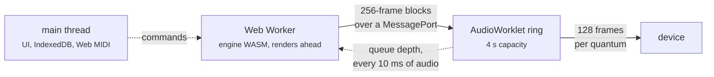

# In the browser {#web}

`apps/web` compiles the whole engine to WebAssembly with Emscripten, and `web/` is the Vue 3
application that serves it. Not a demo and not a thin remote control over a server: the same
ts::ToneGenerator block loop the command line drives, running in the browser's sandbox.

It is live at [**tabula-sonora.kddlb.cl**](https://tabula-sonora.kddlb.cl). Everything below
describes that deployment, so it is worth having open: the
[player](https://tabula-sonora.kddlb.cl/) is the first page and the
[live instrument](https://tabula-sonora.kddlb.cl/live) the second. Supply a DLL and it plays;
nothing here needs building to be read against the running thing.

```sh
cmake --preset web && cmake --build --preset web   # needs the emsdk on PATH
cd web && npm install && npm run build
netlify deploy --prod --dir=web/dist               # manual, replaces the live site
```

The `web` preset takes its toolchain file from `$EMSDK` and does not involve vcpkg. The built
module lands in `web/src/engine/generated/`, which is gitignored.

## Three threads

The architecture is the one thing to understand before reading the rest.



The engine lives in a dedicated Web Worker, which renders ahead of playback and pushes 256-frame
blocks straight to the worklet's ring. The worklet reports its queue depth every 10 ms **of
audio**, and that report — not a timer the browser can delay — is what drives the pump. That is why
a 30 ms lead holds: the queue only has to cover the render itself, not a missed wake-up.

The main thread does UI, IndexedDB and Web MIDI, and nothing else.

This also satisfies the engine's own contract for free. ts::ToneGenerator documents that events and
rendering must come from one thread; the worker owns the engine and is that thread. ts::ChannelMask
is the documented exception, and the mixer changes it live with no rebuild and no gap.

The position shown is the audible one — the renderer's position less whatever is still queued.
Driving a progress bar from the renderer would show the song finishing before it is heard to.

## Two pages, one engine

| | |
|---|---|
| [`/`](https://tabula-sonora.kddlb.cl/) | the **player**: load a song, drive the transport, mix it while it runs, export it to WAV |
| [`/live`](https://tabula-sonora.kddlb.cl/live) | the **instrument**: a controller or the on-screen keyboard, every sound the ROM holds, and the drum maps |

The split is not cosmetic: loading a file and driving a transport has nothing in common with
connecting a controller and playing, and each was burying the other's panels. Navigating changes
which panels are on screen and nothing else — the engine lives in the worker, so the ROM stays
loaded, a playing song keeps playing, and a held note keeps sounding.

The player takes everything ts::formats::to_smf reads, not only SMF — RIFF-MIDI, DirectMusic
`MIDS`, DOOM `MUS`, Miles `XMI`, `GMF`, both HMI containers, Mobile XMF and the LDS tracker — since
the conversion happens under `smf::load`, which is what the session already calls. All but LDS are
recognised by content, so the picker's extension list is a convenience and not the test; LDS has no
magic and is recognised through the file name, which is why the name travels to the worker beside
the bytes.

**The one host requirement.** Two client-side routes and one file on disk: a reload on `/live`, or
a link straight to it, asks the server for a path that was never published. Every static host needs
a catch-all rewriting unknown paths to `index.html` with status **200** — `netlify.toml` carries
one, and `python3 -m http.server` does not, so a local deep-link check needs a host that does.

## No harvested presets

The Blazor deployment this replaces had to ship a `presets.json`: the reverb and chorus
coefficients were believed to exist nowhere in the DLL, and harvesting them meant executing a
64-bit Windows binary, which a browser cannot do under any circumstances. So a Roland-derived file
was committed and embedded in the web application.

That file is gone. ts::EffectProgrammer decodes the coefficients from the user's own DLL, in the
browser, like everywhere else. The web build now carries nothing of Roland's at all.

## What the user has to supply

The engine is inert without `SCCore.dll`, and a web page cannot ship it. The application asks for
it once, verifies it against the pinned build, and keeps it in an IndexedDB database named
`tabula-sonora`:

| | |
|---|---|
| first visit | full verification — size, PE timestamp and the whole SHA-256 |
| later visits | size and PE timestamp only, against the hash recorded when it was stored |

Re-hashing 27 MB on every page load would be a second of nothing happening, and the file cannot
have changed in storage without the record changing with it. The application also asks for
`navigator.storage.persist()`, without which a record that size is best-effort and can be evicted
under disk pressure — which would send the user back to the file picker with no explanation.

The bytes go from the picked file into IndexedDB and reach the engine only inside the page. There
is no upload path and no server to upload to.

ts::RomImage::from_memory exists for this. A browser has no filesystem to give ts::RomImage::open a
path to, so the image reads out of a span instead; nothing downstream can tell the difference, and
the test suite asserts as much over every cached table and a slice of each wave-ROM bank.

## The whole sound set

The live page browses what the loaded ROM actually contains, per vintage. The engine sweeps all
128 banks × 128 programs through ts::PatchDirectory — the same calls it makes on a program
change, so there is no second lookup path to drift out of step — and reports each slot as one of
four things:

- **native**, defined by that bank, which a program change sounds;
- **capital fallback**, empty in that bank, where the module sounds bank 0's tone rather than
  falling silent, so it is playable but is not the bank's own sound;
- **indirect-only**, carrying the `0x8000` marker;
- **unassigned**.

The browser is three columns that narrow — sound map, then instrument, then variant — and that
order is the point. A bank is not a place a player goes to find a sound: most of its 128 slots are
the capital tone showing through, so browsing bank 8 means reading 128 entries of which a handful
are its own. The question worth asking is *which banks define a variation of this instrument*, and
the answer is usually two or three lines. The instrument column is the capital bank, which is the
only one every vintage fills completely, grouped by the sixteen General MIDI families — a layout of
program numbers from the spec, not from the ROM, so the names in it are still the vintage's own.

The bank counts are the vintages themselves: 15 for the SC-55, 24 for the SC-88, 45 for the
SC-88Pro, 51 for the SC-8820.

Banks **126 and 127** are not variations at all, and the first column lists them as sound maps of
their own rather than as variants of a Sound Canvas instrument. They are the CM-64 compatibility
map, so that a file written for Roland's older Computer Music modules plays: 127 is the LA half
(MT-32 / CM-32L) and 126 the PCM half (CM-32P). Both are identical across all four vintages, as a
map belonging to no generation should be.

## Drums are not like that

A program change on the drum part does not go through the three-level melodic lookup; it goes
through ts::DrumKitTable's own pair, whose two map rows are the same whichever vintage is selected.
The module chooses between those rows from the part's *internal* bank code, which is not reversed,
so ts::ToneGenerator::drum_map_row is set by the host instead — without it the second map's kits
cannot be sounded at all.

The two rows are not abstract A and B. The set of programs row 0 defines is exactly the SC-8820's
kit list and row 1's is exactly the SC-88Pro's, with one addition each row carries and neither list
mentions: the CM-64/32L kit at program 128.

Keys are named from the melodic tone table, because drum sounds *are* melodic tones. Kit names are
a different matter: the DLL has none — it will tell you that program 9's key 36 is a `Room Kick 1`,
but nothing in it says program 9 is `ROOM`. Those names are transcribed from the plugin's
`SCVSC.drf` and declared in `NOTICE.md` as the one piece of Roland-derived text this repository
carries. One kit is deliberately unnamed: the CM-64/32L set at program 128, which the ROM defines
on both rows and neither module's list names.

The reverse-cymbal and SFX kits work. 218 wave descriptors are marked to play backwards and the
drum kits reach 167 of them; the wave is simply the ordinary data read from the far end back, which
ts::Sampler does by turning the decoded buffer round — so both renderers get it at once, having
only the one sampler between them.

## Mixing while it plays

The mixer is a stack of live channel strips, one per part, with the four faders across the width of
each row rather than crammed into a column — a fader that is 7rem wide gives one pixel to every
three MIDI values, which is not a control so much as a suggestion.

Which parts get a row is not fixed. The first sixteen are always there: they are what the on-screen
keyboard plays into and what any ordinary file addresses. The engine has thirty-two, and the rest
appear only when the loaded song reaches them — ts::SequencePlayer routes on the port a track is
tagged for, so a two-port file lights up the strips it actually uses and nothing else. A row for a
part that nothing can reach can only mislead.

The two kinds of control on a strip behave differently on purpose:

- **Mute and solo** go to ts::ChannelMask, which sits at the mix where no MIDI message reaches.
  They take effect on the next block, and nothing a file does can undo them.
- **The faders send Control Changes** — volume, pan, and the reverb and chorus sends. The engine
  has no other way in, and tracking the value behind its back would make a second source of truth
  for something the file also writes. So a running sequence overwrites a fader at its next
  controller event for that channel, exactly as it would on the module's own front panel.

## The snapshot the UI reads

Everything the interface shows about a running engine arrives as one JSON document from
`ts_web_snapshot_json`, polled by the worker and posted to the main thread. It is parsed whole and
passed through — nothing between the C++ and the Vue store copies fields one by one — so a field
added on the engine side reaches the store as soon as `protocol.ts` declares its type, and a field
that is *not* declared is silently discarded by nobody: it is simply never looked at. That is worth
knowing because it has already gone wrong once, with a drum kit's name arriving for several days
before anything displayed it.

```json
{
  "position": 1234567, "activeVoices": 12, "noteCount": 340,
  "drumKit": 73, "drumKits": [73, 0], "effectiveDrumMapRow": 4,
  "xgMode": true, "songComplete": false,
  "channels": [ /* one per part */ ]
}
```

| field | meaning |
|---|---|
| `position` | render position in samples |
| `activeVoices`, `noteCount` | what the pool and the sequence are doing |
| `drumKit` | the kit on port A's rhythm part — `drumKits[0]` |
| `drumKits` | the kit on each port's rhythm part, in port order |
| `effectiveDrumMapRow` | the drum map row a program change resolves against |
| `xgMode` | whether the engine is in XG mode **now**; a file turns this on and off while it plays |
| `songComplete` | the loaded song has run out |

Each entry of `channels` is one part, indexed by part number rather than by MIDI channel, so index
16 is port B's channel 1. Before a ROM is loaded every entry is `{}` — the engine does not exist yet
to be asked — which is why the TypeScript side reads them as `Partial<ChannelSnapshot>` and why a
consumer has to tolerate every field being absent rather than only some:

| field | meaning |
|---|---|
| `program`, `bank` | the last program change, and the bank select behind it |
| `name` | what the part is sounding, already resolved — **the kit's own name on a drum part**, and the tone's otherwise. There is nothing further to look up |
| `drums` | whether this part is sounding drums *now*. Not "is this channel 10": GS reroutes a part over SysEx and XG does it from bank select, so the channel number answers neither direction |
| `kit` | the kit index on a drum part, or `-1`. `name` already carries its name; this is for a UI that wants the number as well |
| `map` | the ts::ToneMap this part resolves against, as its integer value. Per part and per moment — XG System On moves every part at once, so one map for the whole mixer is wrong the moment a file switches |
| `volume`, `pan`, `expression`, `reverbSend`, `chorusSend` | the faders' values |
| `voices` | voices this part is sounding, including any fading after being stolen |
| `muted`, `soloed` | the channel mask, which is the UI's own state rather than the file's |

The engine also answers `ts_web_rom_info_json`, `ts_web_song_info_json`, `ts_web_drum_catalog_json`
and `ts_web_vintage_catalog_json`; those are asked for once when something loads rather than polled.
Every one of them returns `"null"` as a string when there is nothing to describe, which
`protocol.ts` turns back into `null`.

## Audio out

The engine renders at 32 kHz and the application asks the browser for an `AudioContext` at 32 kHz.
On a browser that agrees — and they generally do — **nothing resamples anywhere between the final
mix and the device**, the same property the desktop player gets by opening its device at the
engine's rate. Where the browser refuses, the transport says so.

The 30 ms lead is a *default* rather than a constant: the Audio panel makes it settable, with the
queue depth, the realtime factor and the starved-frame count beside it, because where the floor
actually is depends on the machine, the browser and how many voices are sounding. Anything above
zero starved frames means the device ran out and invented some.

## What the browser remembers

Three preferences, all in `localStorage`, none derived from anything of Roland's: the colour theme
under `tabula-sonora.theme`, the engine's vintage and four effect toggles under
`tabula-sonora.engine`, and the output trim under `tabula-sonora.gain`. The trim has its own key
because the engine entry's format is shared with the previous deployment of this page, and a field
that deployment never wrote would have invalidated every preference already stored there. The EFX
toggle *is* such a field — the entry's fifth — so the parser accepts the four-field form too,
reading it as EFX on.

**The default is the absence of an entry.** No key exists until the user chooses something other
than the default, and a value that stops parsing falls back rather than failing. So a visitor who
never opens either control leaves nothing behind, and a change to what the defaults are reaches
everyone who never overrode them. Storage access *throws* where a browser has disabled it, and a
remembered preference is not worth failing a page over, so both directions swallow that and the
page opens at its defaults instead.

## Exporting, and how the build is checked

The WAV export uses the block loop — the same path as `render --stream` — and the same
ts::wav::write. A file exported from the browser and one rendered on the command line with matching
settings are therefore expected to be *byte-identical*, not merely similar, which makes the browser
build checkable against the command line rather than only against itself.

`apps/web/test/smoke.mjs` is that check, and it runs the module under node: full-hash ROM load,
catalog sweeps, a real-time render, and a WAV export byte-compared against `tabula-sonora render
--stream` of the same file — the same file, not a similar one.
