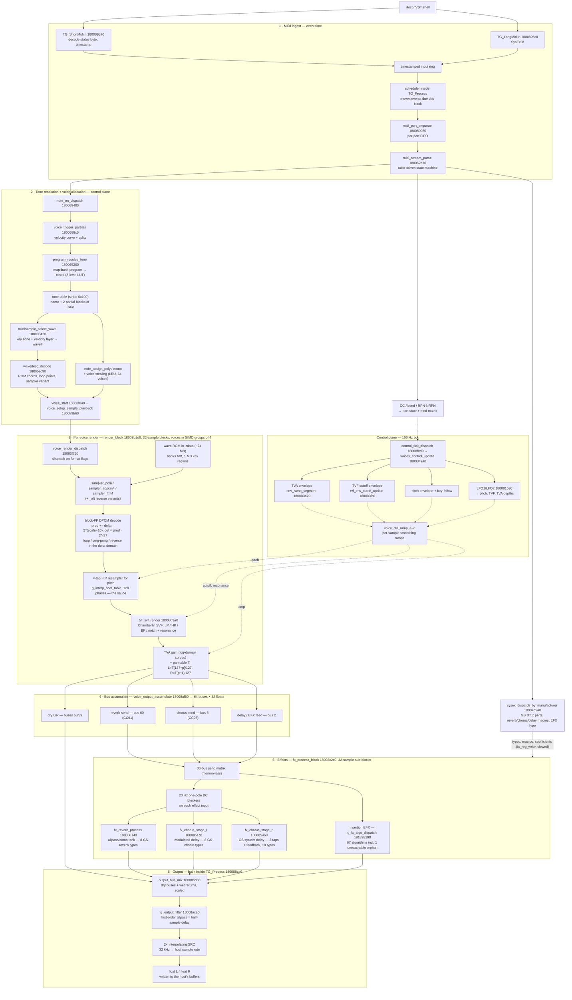

# The route of the sound {#signal-flow}

How a MIDI event becomes sound in the Sound Canvas VA tone-generator core, end to end. This
describes **`SCCore.dll` itself**, not this codebase — for how the port is organised, see
\ref architecture.

Everything here is condensed from the reverse-engineering evidence in
[FINDINGS.md](https://github.com/TabulaSonora/spec/blob/main/docs/FINDINGS.md) and the recovered
symbol map in [SYMBOLS.md](https://github.com/TabulaSonora/spec/blob/main/docs/SYMBOLS.md) (names
are project labels, not Roland's; addresses are virtual, image base `0x180000000`). Confidence tags
apply; this page only restates `[confirmed]` and strongly `[likely]` structure.

## The four clock domains

The route crosses four time bases, and most of the architecture falls out of them:

| Domain | Rate | What runs there |
|---|---|---|
| Event time | timestamped, sample-accurate | MIDI ingest, queues, parser, SysEx |
| Control tick | **100 Hz** (every 320 internal samples = 10 render blocks) | envelopes, LFOs, mod matrix, pitch/TVF/TVA updates |
| Audio block | **32 000 Hz** internal, 32-sample blocks | samplers, filters, bus mix, effects |
| Host rate | whatever `TG_setSampleRate` says | 2× interpolating SRC on the way out |

The internal engine always renders at 32 kHz, the hardware's rate; the host block
(`TG_Process(left, right, count)`) is produced by sample-rate conversion at the very end.

## The chart

Solid arrows are the audio and event path; dotted arrows are control-rate parameter flow. Node
labels carry the virtual address of the function each stage was recovered from, without the leading
`0x`.

## In this implementation

The spec's names and this library's types correspond closely enough to be worth tabulating:

| in the DLL | here |
|---|---|
| `render_block`, `TG_Process` | ts::ToneGenerator |
| `program_resolve_tone`, the tone table | ts::PatchDirectory, ts::Tone |
| `multisample_select_wave`, `wavedesc_decode` | ts::WaveDescriptor, ts::MultisampleZone |
| the wave ROM banks | ts::WaveRom |
| the samplers and the DPCM decode | ts::Sampler |
| `g_interp_coef_table`, the 4-tap FIR | ts::Interpolator |
| `tvf_svf_render` | ts::StateVariableFilter, ts::TvfChain |
| TVA level curves | ts::TvaChain |
| `g_pan_tbl` | ts::PanLaw |
| the pitch envelope and key-follow | ts::PitchChain |
| `voice_pitch_block_init`, `ramp_env_step_eval` | ts::PitchRamp |
| `modmatrix_apply_linear` / `_bipolar`, the `40 2x` block | ts::ControlMatrix |
| the part modify bytes at `part+0x3e4` | ts::PartModifiers |
| `fx_eq_band_preset_apply`, the `40 02` block | ts::Equalizer |
| `LFO1/LFO2` | ts::LfoEngine |
| voice allocation and stealing | ts::VoicePool, ts::Voice |
| the drum kit table | ts::DrumKitTable |
| `fx_process_block` and the send effects | ts::Reverb, ts::Chorus, ts::SystemDelay |
| the GS macro coefficient sets | ts::EffectPresets, ts::EffectProgrammer |
| the static tables as a set | ts::TableSet, ts::TableManifest |

## Stage by stage

### 1 · MIDI ingest

`TG_ShortMidiIn` does no synthesis — it decodes the status byte into an internal event class,
timestamps it, and enqueues it into an input ring. Each `TG_Process` call moves the events whose
timestamps fall inside the current block into a "ready" buffer, drains them to per-port FIFOs, and
a table-driven parser state machine reassembles channel-voice messages. This is the queue →
scheduler → FIFO → parser shape of a hardware unit servicing a UART, carried over intact.

From the parser, events fork three ways: note-on/off into the voice allocator, channel controllers
(CC, bend, aftertouch, RPN/NRPN) into part state and the mod matrix, and SysEx into the GS DT1/RQ1
handlers — which also select the reverb, chorus and delay macros and the insertion-EFX type, so
SysEx configures stage 5.

Events carry a **port** as well as a channel. The queue does not move MIDI bytes; it moves
USB-MIDI Event Packets, whose first byte is `(cable << 4) | class` with the message in the
remaining three. That cable nibble is the port, and it rides in every packet — there is no
port-select call and nothing latches it between messages.

The module has **32 parts**, addressed as `port × 16 + channel`, and allocates all of them
unconditionally. But `midi_drain_ready_to_ports` clears the cable nibble on the way to the FIFO, so
in stock form every event lands on port A and parts 17–32 are unreachable. Widening that mask
admits the second port and no more, which is what this engine implements — see
ts::ToneGenerator::port_count.

### 2 · Tone resolution and voice allocation

A note-on resolves `(map, bank, program)` through a three-level LUT to a tone number,
vintage-selectable per SC-55/88/88Pro/8820 map. The tone record — an ASCII name plus up to two
partial parameter blocks of 0x6e bytes — drives everything downstream: each partial picks its
multisample, the multisample's key zones and velocity layers pick a wave number, and the wave
descriptor yields ROM coordinates, loop points, root key, and the sampler variant (forward-loop,
ping-pong, one-shot, reverse). Polyphony is 64 voices with an LRU note-group list and voice
stealing. `voice_start` populates the per-voice structure-of-arrays state and
`voice_setup_sample_playback` computes the wave-ROM address across the two banks and their 1 MB key
regions.

Starting a note is **two passes, not one**, and the split is observable. `note_assign_poly` claims
the slot at the moment the message is dispatched, so allocation and stealing follow the order the
events arrived in. Reading the note's parameters happens later:
`tg_start_pending_voices @ 18008f020` runs at the top of the next chunk and walks the parts in **GS
block order** — channel 10 first as block 0, then channels 1–9 as blocks 1–9 and 11–16 as blocks
10–15 — so a chunk carrying notes on several channels sets them up in block order however they
arrived. Each part also spends `voices + 1` draws on the shared generator before its notes are set
up. Neither detail is audible on its own; both are, through the one 16-bit LFSR every random
feature shares, because they decide which voice draws which value. See \ref verification.

Drums bypass the melodic LUT via a static note-indexed kit table carrying tone number,
level, coarse pitch at half strength, mute group, pan and sends per key.

### 3 · Per-voice render

`render_block` processes the 64 voices in groups of 4 — the structure-of-arrays layout is
SIMD-shaped. Per voice, per 32-sample block:

1. **Sampler** — `voice_render_dispatch` picks one of six samplers. The wave data is
   block-floating-point DPCM: one signed delta byte per sample plus a shift-exponent nibble per
   16-sample block, integrated into a predictor (`pred += delta·2^(scale+10)`, normalised by
   `2^-27`). Looping rewinds the delta index and keeps the predictor — loops, ping-pong and
   reverse playback all happen in the delta domain, seamlessly.
2. **Pitch** — a 4-tap FIR resampler against a 128-phase coefficient table retunes the wave. This
   interpolator is the single most timbre-defining element of the engine.
3. **Filter (TVF)** — a Chamberlin state-variable filter with per-partial type (LP/HP/BP/notch or
   bypass), cutoff `Fc = 10591·2^((C−245760)/14175)` Hz, resonance from `block[0x30]`.
4. **Amp (TVA) and pan** — log-domain level curves, then the exact 128-entry pan table
   (`L = T[127−p]/127`, `R = T[p−1]/127`; centre = 75/127).

All the *movement* — envelopes (16-bit phase-accumulator segments, `t = 0x10000/rate × 10 ms`), the
two LFO engines, the mod matrix (CC1, bend, aftertouch) — runs on the 100 Hz control tick and is
smoothed to per-sample values by the `voice_ctrl_ramp_a–d` ramps before it touches pitch, cutoff or
gain.

### 4–5 · Buses and effects

Each voice accumulates its output into a 64-bus accumulator: dry L/R (buses 58/59) plus per-voice
send levels into the reverb (bus 60), chorus (bus 3) and delay/EFX (bus 2) buses.
`fx_process_block` then runs a 33-bus send matrix and, in 32-sample sub-blocks, the effect
processors — each behind its own 20 Hz one-pole DC blocker, a hardware-era necessity because the
DPCM predictor drifts. Reverb is an allpass/comb tank whose 8 GS types are coefficient sets over
one topology; chorus is a modulated delay line with 8 types; the GS system delay is a third send
effect with 10 types — three taps and a feedback loop one sample longer than its tap, and no input
pre-delay — carried by `fx_chorus_stage_r`, which is not the chorus. Insertion
EFX is a function-pointer table of 67 distinct algorithm processors selected by a type-to-index
map — including dispatch slot 66, a complete modulated multi-tap delay that nothing can select.

The three send effects are implemented. The insertion EFX block — the spec's scope note leaves it
to this engine — is implemented as ts::InsertionEffect: the block machinery (register file,
per-type preset fill, the two decrementing delay lines, the `40 03` SysEx block and the `40 4x 22`
part routing) is transcribed in full and its directory, presets and parameter curves are decoded
from the user's DLL at runtime, while **ten of the 65 algorithm processors** exist — Thru,
Equalizer, Enhancer, Overdrive, Distortion, Rotary, Hexa Chorus, Space D, Reverb and OD / OD2, each
matching the live block's own coefficient file and tap program word for word under `scdec efxdump`.
The other 55 pass the signal through unchanged, with routing and send levels still honoured, and report themselves via
`InsertionEffect::implemented`.

### 6 · Output

`output_bus_mix` sums the dry buses and wet returns into the output pair, `tg_output_filter` — a
first-order allpass acting as a half-sample delay — feeds the 2× interpolating sample-rate
converter, and `TG_Process` writes the final `float` L/R blocks into the host's buffers. That SRC
is the only place the host sample rate exists; everything upstream is the 32 kHz hardware engine.

## Caveats

- Which of the four `voice_ctrl_ramp_*` functions drives pitch, amp and filter is inferred from
  pipeline position, not individually pinned (`[likely]`).
- The dry path shows measurably zero DC in real renders, but no DC blocker was found on it — the
  three blocker instances all sit on effect inputs. Placement of the dry-path DC removal is an open
  question: host wrapper, mis-decompiled region, or misread routing.
- Insertion-EFX internal routing is pinned end to end. Parts with `part+0x452` set detour to bus
  62 with their sends nulled; the block has no make-up gain (the ×4 an earlier revision fitted on
  the return is in the registers — the startup rows give the routing pair at `0x83`/`0x1F3` the
  wide scale, so routing byte `0x7F` means ×3.97); and the block's three common sends tap its
  **stereo sum**, which is why an EFX send is pan-dependent (measured 1.1825 hard→centre against
  the pan table's centre sum 1.1811) where a part send, fed pre-pan, is flat. The one measured
  rather than traced quantity is the conversion from an engine bus value into this engine's
  per-network units, expressed for reverb as the engine's own EFX-to-part ratio (0.980).
- The insertion-EFX algorithms are verified the same way, through `scdec efxir`, which resets the
  shared state buffer before driving one algorithm by hand — necessary because the modulated types
  run free-running accumulators out of that buffer, so a comparison against a reimplementation
  starting from zero otherwise compares two points of the same sweep. The five transcribed so far
  come out bit-identical (Thru, Overdrive, Rotary) or at the float-against-double floor (EFX
  Reverb 6e-08, OD / OD2 4e-06).
- All three send networks are verified against the live engine's own processors by impulse
  response — `scdec revir` / `choir` / `dlyir` drive `fx_reverb_process`, `fx_chorus_stage_l` and
  `fx_chorus_stage_r`, and `tools/dump_effects_dll.py` captures all 26 GS networks as the test
  gate. Agreement is within 5e-5 on every one, which is the float-against-double floor rather than
  a modelling error. Wet levels compared off *rendered notes* instead differ by up to ~11% and vary
  with the patch — that is the dry signal feeding the reverb, not the reverb — so networks are
  compared with an impulse and never with a note.
- `fx_chorus_stage_r` is the **GS system delay**, not the chorus's right channel: three taps with
  their own gains, a feedback path, a pre-LPF on the input, and a send into the reverb, working the
  region of the shared delay memory 0x8000 below the chorus's. Its Ghidra name misleads.
- The chorus sweep LFO free-runs, so its response is only reproducible from a known phase; the
  capture pins the engine's accumulator to zero, where this engine's starts.
- Bus numbering (58/59 dry, 60 reverb, 3 chorus, 2 delay/EFX) comes from the DC-blocker and
  accumulator analysis; treat individual bus indices as evidence-backed labels, not a verified full
  bus map.
